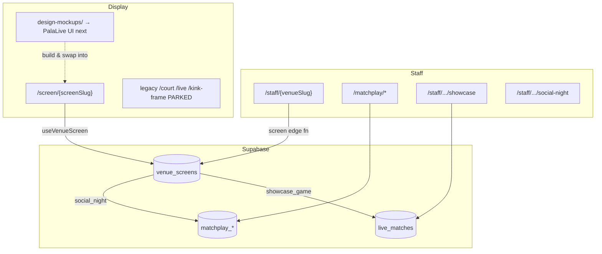

# PalaPoint V4 → PalaLive — Developer Handover

**Last updated:** July 2026  
**Audience:** Engineers joining the project or taking over active development  
**Production:** [https://palapoint-v4.vercel.app](https://palapoint-v4.vercel.app)

This document explains **what the repo is today**, **the locked product decisions**, and **how to build next** without re-deriving context from chat history.

---

## 0. Locked decisions (read this first)

These are settled. Do not re-litigate unless product explicitly reopens them.

| Decision | Locked answer |
|----------|---------------|
| **New repo vs extend this one** | **Extend this repo.** Do **not** start a separate “v5 / PalaLive” project. |
| **Product name for the new work** | **PalaLive** — venue display product (Idle / Social Night / Showcase Game). |
| **Visual source of truth** | **`design-mockups/`** — modular HTML/CSS skeleton + staff flows. |
| **kink-frame** | **Parked / forget for now.** Early exploration only. Not the shipping UI. |
| **Legacy court stack** | **Parked.** Keep in repo for existing venues; do not build new features against it. |

### Why not a clean greenfield v5?

The desire for a clean PalaLive codebase is valid — mixing old court product and new venue display *feels* messy. What you actually want from “clean” is:

1. One mental model (venue screen + staff app + three modes)
2. One visual system (the mockups)
3. Legacy clearly frozen so nobody builds against it by accident

The expensive plumbing for that **already exists** here: `venue_screens`, `/screen/[screenSlug]`, `/staff/[venueSlug]`, Realtime mode switching, pairing auth, matchplay, scoring. A new project would mostly re-solve those problems under a nicer folder name.

**Compromise:** keep building in this repo, put PalaLive UI under clear boundaries, park everything else. Optionally extract a thin PalaLive package later — that’s a *split*, not a rewrite.

---

## 1. Executive summary

This repo started as **PalaPoint V4**: a Next.js 14 + Supabase **per-court live scoring system** (FLIC, player QR, court TV, staff control).

The business direction is now:

> **PalaLive** — a **venue display product**: one permanent URL per venue screen, one staff phone app, three modes (**Idle**, **Social Night**, **Showcase Game**).

| Layer | Status | Mental model |
|-------|--------|--------------|
| **PalaLive (target)** | **Active** | `design-mockups/` → real React components → `/screen/*` + `/staff/*` |
| **Venue orchestration** | **Working in production** | `venue_screens` + `screen` edge function |
| **Matchplay + showcase scoring** | **Keep / reuse** | Social Night + Showcase logic |
| **kink-frame** | **Parked** | `/kink-frame/*` — design exploration; do not extend |
| **Legacy court stack** | **Parked** | `/court`, `/setup`, `/playing`, FLIC/WebSocket |

---

## 2. PalaLive product direction (target state)

### What venues get

- **One permanent display URL per screen** (Firestick / TV browser bookmarked once)
- **One staff phone app per venue** (mode picker + scoring/setup)
- **Three display modes**, switched by staff:

| Mode | Staff does | Display shows |
|------|------------|---------------|
| **Idle** | Nothing / end event | Branding, court availability, promos, optional stream |
| **Social Night** | Run Americano via matchplay hub | Fixtures, standings, player roster |
| **Showcase Game** | Score a single match from phone | Live scoreboard for that match |

### Explicitly out of scope

- FLIC hardware and physical court buttons
- Player self-serve QR setup (`/setup`, `/playing`, `sessions`)
- Raspberry Pi / WebSocket button bridges
- Per-court display URLs as the primary product surface
- Further kink-frame geometry / notched-frame work

### Visual source of truth: `design-mockups/`

Static, self-contained HTML/CSS — open `design-mockups/index.html` locally.

| Screen set | File | Covers |
|------------|------|--------|
| Venue TV | `palalive-display-skeleton.html` | Idle, Social Night, Showcase + variants (auto-scale) |
| Venue TV (literal 1920×1080) | `palalive-display-skeleton-fullsize.html` | Firestick-accurate size |
| Showcase staff (phone) | `palalive-showcase-flow.html` | Setup → live scoring → end states |
| Matchplay staff (phone) | `palalive-matchplay-flow.html` | Launcher → players → live → score → results |

**Layout language (canonical):** flat rectangular frame, side-by-side panels, **full-width bottom bar** (logo left, clock/weather right) — *not* the old kink-frame notched pocket.

Build real React components to match these mockups, then swap them into `/screen/[screenSlug]` in place of today’s temporary renderers (`ScreenIdle`, `MatchplayBoard`, `SpectatorDisplay`).

---

## 3. What the repo is today (honest inventory)

### A. Venue screen orchestration — **ACTIVE · keep**

**Display:** `/screen/[screenSlug]` → `VenueScreenDisplay` + `useVenueScreen` (Realtime + 5s poll).

| `active_mode` | Current renderer |
|---------------|------------------|
| `idle` | `ScreenIdle` (minimal — replace with PalaLive Idle) |
| `social_night` | `MatchplayBoard` when event linked (replace with PalaLive Social) |
| `showcase_game` | `SpectatorDisplay` when match linked (replace with PalaLive Showcase) |

**Staff:** `/staff/[venueSlug]` → pairing + mode control → `supabase/functions/screen`.

This layer is **production plumbing**. Do not rebuild it. Replace the *UI inside* the mode branches.

### B. Matchplay (`/matchplay/*`) — **KEEP · Social Night core**

Staff Americano: setup, hub, results, rounds. No FLIC/sessions.  
Edge: `matchplay-event`, `matchplay-player`, `matchplay-round`. Client: `lib/api/matchplay.ts`.

Staff entry also via `/staff/[venueSlug]/social-night`.

### C. Showcase scoring — **KEEP UX · re-scope URL**

`ControlPanel` + `/staff/[venueSlug]/showcase` — phone-tap scoring. Prefer `source: 'control_panel'`. Park button/`ready_ack` paths.

### D. Legacy court stack — **PARK**

| Route | Notes |
|-------|--------|
| `/court/*` | Court TV + FLIC simulation + QR idle |
| `/setup/*`, `/playing/*` | Player self-serve / sessions |
| `/live/*` | Per-court spectator (logic reusable; URL legacy) |
| `/control/*` | Per-court staff URL (logic reusable via staff showcase) |

Do not add features here unless a live legacy venue requires it.

### E. kink-frame — **PARK / forget**

`/kink-frame`, `/kink-frame/skeleton`, `/kink-frame/skeleton/display` and `components/layout/KinkFrame*.tsx` were the **first UI exploration** (notched frame, broadcast glass demos). Useful historically; **not** the PalaLive shipping shell.

- Do **not** wire kink-frame into `/screen`
- Do **not** continue geometry or mode work there
- Cherry-pick motion/patterns only if a PalaLive build explicitly needs them — prefer matching mockups first

### F. Ops & design system

- `/status` — ops counter; keep
- `/design-system/*` — keep in sync for shared UI (workspace rule)

---

## 4. Architecture (current)



### `venue_screens` (central orchestration)

Migrations: `20250701120000_venue_screens.sql` (+ secrets migration for pairing).

| Column | Purpose |
|--------|---------|
| `screen_slug` | Public TV URL (`/screen/{slug}`) |
| `venue_slug`, `company_slug` | Staff app resolution |
| `active_mode` | `idle` \| `social_night` \| `showcase_game` |
| `active_matchplay_event_id` | Linked Social Night event |
| `active_showcase_match_id` | Linked showcase match |
| `court_id` | **Internal** — branding / live-match plumbing |

Types: `lib/types/venue-screen.ts` · Hook: `lib/hooks/useVenueScreen.ts` · API: `lib/api/screen.ts` · Edge: `supabase/functions/screen/index.ts`

---

## 5. How to grow PalaLive in this repo (boundaries)

Aim for a **clean product surface** inside the existing app:

| Do | Don’t |
|----|--------|
| Build TV/staff UI against `design-mockups/` | Rebuild `/screen` orchestration from scratch |
| Swap components into `VenueScreenDisplay` mode branches | Wire or extend kink-frame |
| Add PalaLive CSS/components under a clear prefix (e.g. `components/palalive/`, `app/styles/palalive-*`) | Mix new UI into court-session paths |
| Reuse matchplay + scoring + `useLiveMatch` | Reimplement scoring or pairing |
| Leave `/court`, `/setup`, `/playing`, kink routes frozen | “Clean up” by massive deletion mid-flight |

Repo folder cleanliness can wait; **product boundaries** matter now.

---

## 6. Staff app flow (current)

```
/staff/{venueSlug}
  ├── Pair screen (pairing code)
  ├── Set mode: Idle | Social Night | Showcase Game
  ├── /staff/{venueSlug}/social-night  → matchplay event → set_social_night
  └── /staff/{venueSlug}/showcase      → ControlPanel scoped to venue screen
```

Helpers: `lib/venue-screen-staff-context.ts`, `lib/venue-screen-resume.ts`  
Frame: `components/venue-screen/StaffAppFrame.tsx`

Staff **look** should later match `palalive-showcase-flow.html` and `palalive-matchplay-flow.html`; staff **logic** mostly exists.

---

## 7. Scoring & domain logic (keep)

| Module | Path | Notes |
|--------|------|-------|
| Scoring engine | `lib/scoring/*`, edge `_shared/scoring` | Mode-agnostic |
| Match API | `supabase/functions/match` | Create/start/end |
| Score API | `supabase/functions/score` | Prefer `control_panel` source |
| Names | `lib/utils/name-format.ts` | Shared labels |
| Branding | `lib/venue.ts` | Venue colours / logo |

Known debt (fix, don’t port blindly): Americano pairing bugs, scoring-engine client/edge drift, client-side round generation — see `docs/full-codebase-review-2026-06-19.md` and `docs/matchplay-event-hub.md`.

---

## 8. Development setup

```bash
npm install
# create .env.local — see README.md
npm run dev              # http://localhost:3000
npm test                 # scoring + name-format unit tests
```

```bash
NEXT_PUBLIC_SUPABASE_URL=
NEXT_PUBLIC_SUPABASE_ANON_KEY=
SUPABASE_SERVICE_ROLE_KEY=        # /status — server only
NEXT_PUBLIC_MATCHPLAY_VENUE_ID=   # optional
```

```bash
supabase functions deploy screen
supabase functions deploy matchplay-event
supabase functions deploy matchplay-player
supabase functions deploy matchplay-round
supabase functions deploy match
supabase functions deploy score
```

Open mockups: `design-mockups/index.html`.

---

## 9. Recommended reading order

1. **This document** — locked decisions + orientation
2. **`design-mockups/`** — open `index.html`; treat as UI source of truth
3. [`docs/venue-display-product-inventory.md`](docs/venue-display-product-inventory.md) — KEEP/MODIFY/PARK audit (verify against current code; some gaps closed)
4. [`README.md`](README.md) — env, routes, deploy
5. [`docs/matchplay-event-hub.md`](docs/matchplay-event-hub.md) — Social Night hub
6. [`docs/full-codebase-review-2026-06-19.md`](docs/full-codebase-review-2026-06-19.md) — tech debt

External design brief (if available): `palalive-rebuild-brief.md` — aligns with “extend v4 + mockups”; some kink-frame status notes may be stale relative to this handover.

---

## 10. Suggested next steps

### Near term (PalaLive)

1. **Idle TV shell from mockups** — frame, bottom bar, panels; mount under `/screen` idle branch
2. **Social Night TV** — fixtures + players/standings from mockups; replace `MatchplayBoard` branch with live event data
3. **Showcase TV** — scoreboard from mockups; replace `SpectatorDisplay` branch; keep live-match subscription
4. **Staff visual pass** — align phone UI to showcase + matchplay mockup flows
5. **Idle integrations** — Playtomic bookings (normalised type + edge function), sponsors, weather, video playlist config

### Explicitly not next

- New PalaLive/v5 repository
- kink-frame → `/screen` wiring
- kink-frame geometry or mode expansion
- FLIC / session / QR self-serve features

---

## 11. Quick route reference

| Route | Audience | Status |
|-------|----------|--------|
| `/screen/[screenSlug]` | Venue TV | **PalaLive display** — keep plumbing; replace UI |
| `/staff/[venueSlug]` | Staff phone | **PalaLive control** — keep; restyle later |
| `design-mockups/*` | Design | **Source of truth** |
| `/matchplay/*` | Staff | Social Night keep |
| `/staff/.../showcase` | Staff | Showcase scoring keep |
| `/kink-frame/*` | — | **Parked** |
| `/court/*`, `/live/*` | Display | **Legacy parked** |
| `/setup/*`, `/playing/*` | Player | **Legacy parked** |
| `/control/*` | Staff | Legacy URL; logic via staff showcase |
| `/status` | Ops | Keep |
| `/design-system/*` | Design/dev | Keep |

---

## 12. Open product questions (still useful)

- Idle media: hosted MP4 playlist vs other (Firestick constraints)
- Multiple screens per venue: independent modes vs shared venue state
- Pairing code rotation / ops security for `venue_screen_secrets`
- When legacy Padel4All court URLs retire for migrated venues
- Playtomic / weather / sponsors rollout order after Idle shell exists

---

## 13. Contact & repo

- GitHub: [juicebox-glen/palapoint-v4](https://github.com/juicebox-glen/palapoint-v4)
- Stack: Next.js 14, React 18, TypeScript, Supabase, Vercel

**One-liner for new sessions:** *PalaLive UI from `design-mockups/`, mount into existing `/screen` + `/staff`; park kink-frame and the old court stack; do not spin a new repo.*
