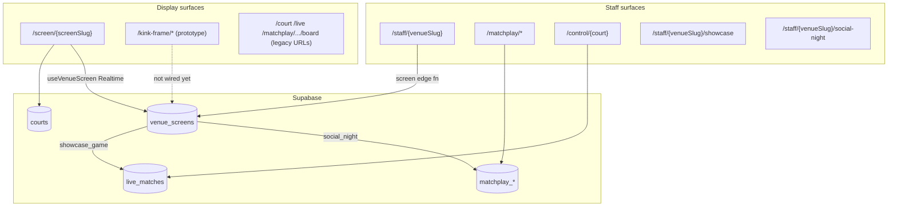

# PalaPoint V4 — Developer Handover

**Last updated:** July 2026  
**Audience:** Engineers joining the project or taking over active development  
**Production:** [https://palapoint-v4.vercel.app](https://palapoint-v4.vercel.app)

This document explains **what V4 is today**, **where the product is going**, and **how the codebase is organised** so you can work effectively without relying on chat history.

---

## 1. Executive summary

PalaPoint V4 is a **Next.js 14 + Supabase** app originally built as a **per-court live scoring system** (FLIC buttons, player QR setup, court TV, staff control). The business direction has shifted:

> **PalaPoint becomes a venue display product** — one permanent URL per venue screen, driven by one staff phone app, with three modes: **Idle**, **Social Night**, and **Showcase Game**.

The repo therefore contains **two overlapping stories**:

| Story | Status | Your mental model |
|-------|--------|-------------------|
| **Legacy court stack** | Still in repo, largely **parked** for new work | `/court`, `/setup`, `/playing`, FLIC/WebSocket paths |
| **Venue display product** | **In active build** | `/screen/*`, `/staff/*`, matchplay integration, new **kink-frame** TV shell |

**Most new display UI work happens in the kink-frame prototype.** Most new orchestration/backend work happens around **`venue_screens`** and the staff app. Legacy routes remain for existing venues and reference implementations.

---

## 2. New product direction (target state)

### What venues get

- **One permanent display URL per screen** (Firestick / TV browser bookmarked once)
- **One staff phone app per venue** (mode picker + scoring/setup)
- **Three display modes**, switched by staff:

| Mode | Staff does | Display shows |
|------|------------|---------------|
| **Idle** | Nothing / end event | Branding, court availability, promos, optional stream |
| **Social Night** | Run Americano via matchplay hub | Fixtures, standings, player roster |
| **Showcase Game** | Score a single match from phone (`ControlPanel`) | Live scoreboard for that match |

### Explicitly out of scope (new model)

- FLIC hardware and physical court buttons
- Player self-serve QR setup (`/setup`, `/playing`, `sessions` table)
- Raspberry Pi / WebSocket button bridges
- Per-court display URLs as the primary product surface

### Mode mapping from old code

```
NEW MODEL                         CURRENT / REUSE CANDIDATES
──────────────────────────────────────────────────────────────
Idle venue screen                 KinkFrame skeleton (WIP) + ScreenIdle (minimal today)
Social Night staff phone          app/matchplay/* + app/staff/*/social-night
Social Night venue display        KinkFrame social layout (WIP) OR MatchplayBoard (wired today)
Showcase Game staff phone         ControlPanel + app/staff/*/showcase
Showcase Game venue display       SpectatorDisplay (wired today) → kink-frame showcase (WIP)
```

---

## 3. What V4 is today (honest inventory)

The codebase is **three parallel products** sharing Supabase and branding:

### A. Matchplay (`/matchplay/*`) — **KEEP · core for Social Night**

Staff-run Americano events: setup wizard, hub, manual results, round advance, TV board.

- **No FLIC, no sessions** — already aligned with Social Night staff flow
- Uses **logical court labels** (strings), not FKs to `courts`
- Edge functions: `matchplay-event`, `matchplay-player`, `matchplay-round`
- Client API: `lib/api/matchplay.ts`

**Gap:** Board URL is per-event (`/matchplay/[id]/board`), not the permanent venue screen URL.

### B. Court stack (`/court`, `/setup`, `/playing`, `/control`, `/live`) — **PARK for new direction**

Built for walk-up play: QR idle → player phone setup → FLIC ack → live scoring.

| Route | Role today | New direction |
|-------|------------|---------------|
| `/court/*` | Court TV + button simulation + QR idle | **Park** — hardware/self-serve |
| `/setup/*`, `/playing/*` | Player phone flows | **Park** — sessions model |
| `/control/*` | Staff scoring per physical court | **Reuse scoring UX** for Showcase; re-scope URL |
| `/live/*` | Read-only spectator per court | **Reuse display phases** for Showcase; re-scope URL |

**Keep from here:** `ControlPanel`, `SpectatorDisplay`, scoring engine, `useLiveMatch` patterns.

### C. Venue screen orchestration (`/screen/*`, `/staff/*`) — **ACTIVE · bridge to target**

This layer **already exists** (July 2026) and is the integration point between staff and displays.

**Display (TV):** `/screen/[screenSlug]`  
→ `VenueScreenDisplay` reads `venue_screens` via Realtime and renders:

- `idle` → `ScreenIdle`
- `social_night` → `MatchplayBoard` (when event linked)
- `showcase_game` → `SpectatorDisplay` (when match linked)

**Staff:** `/staff/[venueSlug]`  
→ Pairing code + screen picker + mode buttons → `screen` edge function writes `venue_screens`.

**Important:** Production display still uses **old visual components** (matchplay board, spectator). The **kink-frame** work is the **next-generation shell** not yet wired to `/screen/*`.

### D. Ops & design system

- `/status` — games-started counter (service role). Orthogonal, keep.
- `/design-system/*` — component/showcase hub. Keep in sync when changing shared UI (see `.cursor/rules/design-system-sync.mdc`).

---

## 4. Architecture (current)



### Central orchestration row: `venue_screens`

Migration: `supabase/migrations/20250701120000_venue_screens.sql`

| Column | Purpose |
|--------|---------|
| `screen_slug` | Public TV URL key (`/screen/{screen_slug}`) |
| `venue_slug`, `company_slug` | Staff app resolution |
| `pairing_code` | Shared secret for staff writes (not user auth) |
| `active_mode` | `idle` \| `social_night` \| `showcase_game` |
| `active_matchplay_event_id` | Linked Social Night event |
| `active_showcase_match_id` | Linked showcase match |
| `court_id` | **Internal only** — branding + `useLiveMatch` for Showcase |

Types: `lib/types/venue-screen.ts`  
Display hook: `lib/hooks/useVenueScreen.ts`  
Staff API: `lib/api/screen.ts`  
Edge function: `supabase/functions/screen/index.ts`

---

## 5. Kink-frame — the new venue TV shell (WIP)

The **kink-frame** is a **1920×1080** venue display layout with a distinctive frame geometry (“kink” notch bottom-right for logo/clock). It is being built **alongside** production `/screen/*`, not replacing it yet.

### Routes

| Route | Purpose |
|-------|---------|
| `/kink-frame` | Full demo: Idle / Showcase / Social / Social·Flat with transitions |
| `/kink-frame/skeleton` | **v2 skeleton preview** — toolbar, mockup overlay, mode tabs |
| `/kink-frame/skeleton/display` | **Full-bleed TV output** — no toolbar, for Firestick |

Design system entry: `/design-system/layouts` links to these routes.

### Key files

| Area | Path |
|------|------|
| v2 geometry (mask, SVG overlay, insets) | `lib/layout/kink-frame-v2-geometry.ts` |
| Mode constants | `lib/layout/kink-frame-venue-mode.ts` |
| Broadcast transitions | `lib/layout/kink-frame-transitions.ts` |
| Styles | `app/styles/kink-frame.css` |
| Full venue demo | `components/layout/KinkFrameVenueScreen.tsx` |
| v2 skeleton (preview + device) | `components/layout/KinkFrameSkeletonDisplay.tsx` |
| Skeleton content router | `components/layout/KinkFrameSkeletonVenueContent.tsx` |

### Skeleton v2 content by mode (current build)

| Tab | Layout |
|-----|--------|
| **Idle** | Right: court bookings loop (`KinkFrameCourtAvailability` → bookings + feature card) |
| **Showcase** | Same as idle today (placeholder — showcase panels exist on full `/kink-frame` demo) |
| **Social** | **Left:** event title + round + 2×2 court fixtures (`KinkFrameSkeletonSocialLeftPanel`) · **Right:** player roster with scroll (`KinkFrameSocialPlayersList`) |

### Shared UI patterns

- **Broadcast glass panel:** `kink-frame-courts-broadcast` + `--on-air` + `--in`/`--hold`/`--out` — staggered enter/exit for cards
- **Right column slot:** `KinkFrameContentPanel` — frosted panel over media
- **Left column slot:** `KinkFrameLeftContentPanel` — social fixtures only (social mode)
- **Demo data:** `lib/layout/kink-frame-social-data.ts`, `lib/layout/kink-frame-social-players.ts`

### Geometry notes (v2)

- Frame border: **20px**, kink pocket height: **140px**
- Frame colour: `#0E1116`, content background: `#2d343e`
- Logo inset: **48px** (border + gutter) from inner content edge
- Right column bottom inset clears kink pocket via `--kink-venue-slot-bottom`

### What is NOT done yet

- Wire kink-frame skeleton → `/screen/[screenSlug]` (replace `MatchplayBoard` / `SpectatorDisplay` / `ScreenIdle`)
- Connect skeleton to live matchplay + showcase data (still demo fixtures)
- Idle video/stream (removed from skeleton; main `/kink-frame` idle may still use YouTube via `KinkFrameMediaBackdrops`)
- Showcase mode on skeleton (only on full `/kink-frame` demo)
- Weather/clock widget in kink pocket (mockup shows it; not implemented on skeleton)

---

## 6. Staff app flow (current)

```
/staff/{venueSlug}
  ├── Pair screen (pairing code in localStorage)
  ├── Set mode: Idle | Social Night | Showcase Game
  ├── /staff/{venueSlug}/social-night  → create/link matchplay event → set_social_night
  └── /staff/{venueSlug}/showcase      → ControlPanel scoped to venue screen
```

Context helpers: `lib/venue-screen-staff-context.ts`  
Resume hints: `lib/venue-screen-resume.ts`

Staff frames: `components/venue-screen/StaffAppFrame.tsx`

---

## 7. Scoring & domain logic (keep)

| Module | Path | Notes |
|--------|------|-------|
| Scoring engine | `lib/scoring/*`, `supabase/functions/_shared/scoring` | Mode-agnostic tennis/padel rules |
| Match API | `supabase/functions/match` | Create/start/end match |
| Score API | `supabase/functions/score` | Use **`source: 'control_panel'`** for Showcase; park `button_a`/`button_b` |
| Name formatting | `lib/utils/name-format.ts` | Shared player labels (used in kink-frame social) |
| Branding | `lib/venue.ts` | `VenueBranding`, CSS vars, logo resolution |

---

## 8. Development setup

```bash
npm install
cp .env.local.example  # create .env.local — see README.md
npm run dev              # http://localhost:3000
npm test                 # scoring + name-format unit tests
```

### Required env vars

```bash
NEXT_PUBLIC_SUPABASE_URL=
NEXT_PUBLIC_SUPABASE_ANON_KEY=
SUPABASE_SERVICE_ROLE_KEY=   # /status only — server-side
NEXT_PUBLIC_MATCHPLAY_VENUE_ID=  # optional default venue
```

### Supabase

Deploy edge functions from repo root:

```bash
supabase functions deploy screen
supabase functions deploy matchplay-event
supabase functions deploy matchplay-player
supabase functions deploy matchplay-round
supabase functions deploy match
supabase functions deploy score
```

Apply migrations including `venue_screens` before testing `/screen/*` or `/staff/*`.

---

## 9. Recommended reading order

1. **This document** — orientation
2. [`docs/venue-display-product-inventory.md`](docs/venue-display-product-inventory.md) — detailed KEEP/MODIFY/PARK audit (June 2026; some “doesn’t exist” items now exist — see §3C above)
3. [`README.md`](README.md) — env, routes, deploy commands
4. [`docs/matchplay-event-hub.md`](docs/matchplay-event-hub.md) — Social Night staff hub
5. [`docs/design-system-audit.md`](docs/design-system-audit.md) — tokens and preview routes

---

## 10. Suggested next steps for incoming developers

### Near term (product)

1. **Wire kink-frame skeleton to `/screen/[screenSlug]`** — swap `VenueScreenDisplay` render branches to kink-frame components per `active_mode`
2. **Replace demo data** in skeleton social with live matchplay fixtures + roster from `active_matchplay_event_id`
3. **Implement Showcase on skeleton** — reuse `KinkFrameShowcasePanel` from full demo
4. **Idle content model** — sponsors, upcoming events, stream embed (config + components missing)
5. **Unify staff app** — single `/staff/{venue}` flow; reduce need to open raw `/matchplay` or `/control` URLs

### Near term (tech debt)

1. **Park or gate legacy routes** — document which URLs are deprecated for new venues
2. **Decouple Showcase from `court_id`** where possible — `court_id` on `venue_screens` is internal plumbing today
3. **Design system sync** — any kink-frame UI change should update `/design-system` previews (workspace rule)

### Do not invest in (unless maintaining legacy venues)

- CourtDisplay WebSocket / keyboard FLIC simulation
- Session takeover / QR idle funnels
- `ready_ack` / hardware-ack scoring paths

---

## 11. Quick route reference

| Route | Audience | Product era |
|-------|----------|-------------|
| `/screen/[screenSlug]` | Venue TV | **New** — orchestrated display |
| `/staff/[venueSlug]` | Staff phone | **New** — mode control |
| `/kink-frame/skeleton/display` | Venue TV | **New UI prototype** |
| `/matchplay/*` | Staff | Social Night (keep) |
| `/control/*` | Staff | Showcase scoring (modify scope) |
| `/live/*`, `/court/*` | Display | Legacy per-court |
| `/setup/*`, `/playing/*` | Player | Legacy self-serve (park) |
| `/status` | Ops | Keep |
| `/design-system/*` | Design/dev | Keep |

---

## 12. Questions to clarify with product

- **Idle stream:** YouTube embed vs hosted MP4 vs none on Firestick?
- **Social display:** Matchplay board layout vs kink-frame social (fixtures left + players right) — which is canonical?
- **Multiple screens per venue:** Mode per screen or shared venue state?
- **Pairing code rotation:** Operational security model for `venue_screens.pairing_code`
- **Legacy venue migration:** When do Padel4All court URLs get retired?

---

## 13. Contact & repo

- GitHub: [juicebox-glen/palapoint-v4](https://github.com/juicebox-glen/palapoint-v4)
- Stack: Next.js 14, React 18, TypeScript, Supabase (Postgres + Edge Functions + Realtime), Vercel

For deep dives on specific subsystems, start from the file tables in [`docs/venue-display-product-inventory.md`](docs/venue-display-product-inventory.md) and verify against current code — the venue screen layer has evolved since that audit was written.
