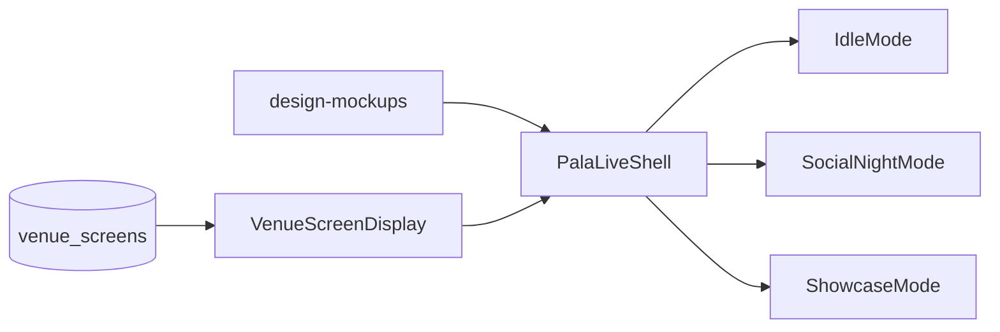

# PalaLive Build Plan

**Status:** Active roadmap  
**Last updated:** July 2026  
**Companions:** [`DEVELOPERHANDOVER.md`](../DEVELOPERHANDOVER.md) (locked decisions), [`docs/palalive-rebuild-brief.md`](palalive-rebuild-brief.md) (context), [`docs/palalive-integration-brief.md`](palalive-integration-brief.md) (data/integrations)

This is the **operational whole-arc plan** for building PalaLive in the existing v4 repo. Use it as the shared map; when executing a phase, deepen only *that* phase (findings → build → demo). Do not turn this into a 50-page PRD before Phase 1 code exists.

---

## How to use this doc

1. Read locked decisions in [`DEVELOPERHANDOVER.md`](../DEVELOPERHANDOVER.md) §0 — they still win if anything here drifts.
2. Treat [`design-mockups/`](../design-mockups/) as the visual source of truth.
3. Run **one phase per focused session**. At session start: review existing code vs mockups, list what exists / missing, **report findings before writing code**.
4. Definition of done for every TV phase: demoable on a real `/screen/[screenSlug]` (or the PalaLive preview route from Phase 0) at 1920×1080 / Firestick-shaped viewport.

---

## Locked constraints

| Constraint | Rule |
|------------|------|
| Repo | Extend this repo — no greenfield v5 |
| Visual SoT | `design-mockups/` (display skeleton + staff flows) |
| Mount point | Swap UI into [`VenueScreenDisplay`](../components/venue-screen/VenueScreenDisplay.tsx); keep `venue_screens` + `/staff` plumbing |
| New code | `components/palalive/` + `app/styles/palalive-*` |
| Parked | `kink-frame`, legacy `/court` `/setup` `/playing` FLIC/sessions |

---

## Architecture target



**`PalaLiveShell` owns:** 1920×1080 frame, left/right Main Stage panels, full-width bottom bar (logo left; clock / weather right).

**Modes own:** only Main Stage content for Idle / Social Night / Showcase. Do not reinvent frame chrome per mode.

**Orchestration stays:** `useVenueScreen` → `active_mode` → shell + mode content. Placeholders remain when Social/Showcase have no linked event/match.

---

## Phase overview

| Phase | Focus | Swaps / delivers |
|-------|--------|------------------|
| **0** | Foundations | Tokens, shell, preview route, data props boundary (lands with Phase 1) |
| **1** | Idle TV | Replace `ScreenIdle` branch |
| **2** | Social Night TV | Replace `MatchplayBoard` when event linked |
| **3** | Showcase TV | Replace `SpectatorDisplay` when match linked |
| **4** | Staff visual pass | Align phone UI to staff mockups |
| **5** | Idle integrations | Playtomic, sponsors, weather, video playlist |

---

## Phase 0 — Foundations (with Phase 1, not a solo product ship)

Land these so Phase 2–3 do not re-layout the TV.

| Deliverable | Notes |
|-------------|--------|
| CSS tokens | Port from mockup: `--frame`, `--accent`, panel sizes, team colours (mockup decisions win — see rebuild brief deliberate list) |
| `PalaLiveShell` | Frame + left/right slots + bottom bar slots |
| Preview route | e.g. `/design-system/...` or `/palalive/preview` — iterate without staff pairing |
| Data boundary | Mode components take normalised props/hooks; no Playtomic calls in components |

**Idle bookings mock type** (final live source = edge function later):

```typescript
type CourtBooking = {
  court_name: string
  court_number: number
  next_booking_start: string  // ISO
  next_booking_name: string
  session_type: 'private' | 'coaching' | 'club_event' | 'social_night' | 'available'
  is_available_now: boolean
  available_from?: string
}
```

**Done when:** Shell renders in preview at correct aspect; slots are empty-or-stubbed but dimensionally match mockups.

---

## Phase 1 — Idle TV

| In scope | Out of scope |
|----------|--------------|
| Replace `ScreenIdle` in `VenueScreenDisplay` | Playtomic API |
| Left: photo / static video placeholder | Sponsors table / moment layer APIs |
| Right: court booking cards (mock data, locked card rules) | Live weather API |
| Bottom bar: logo + client clock; weather stub | kink-frame reuse |

**Reference:** `design-mockups/palalive-display-skeleton.html` Idle state; locked booking-card rules in rebuild brief §6.

**Done when:** `/screen/[slug]` in `idle` shows PalaLive Idle shell (not old `ScreenIdle`); bookings look like mockups with mock data.

---

## Phase 2 — Social Night TV

| In scope | Out of scope |
|----------|--------------|
| Replace `MatchplayBoard` when `active_matchplay_event_id` set | Staff matchplay redesign (Phase 4) |
| Left: title + round + 2×2 fixtures (full names, photos, VS) | New Americano schema |
| Right: players → leaderboard → standings by event phase | Rewriting pairing algorithm unless it blocks display |
| Keep “waiting for event” placeholder when unlinked | |

**Realtime:** Reuse matchplay subscriptions/patterns the board already uses; verify round change + score entry update the TV.

**Done when:** Linked Social Night on `/screen/[slug]` matches mockup Social layout with live fixtures/standings.

---

## Phase 3 — Showcase TV

| In scope | Out of scope |
|----------|--------------|
| Replace `SpectatorDisplay` when showcase match linked | Changing scoring engine rules |
| Left: live scoreboard; serving border ≥10px at 1920×1080 | FLIC / button paths |
| Right: match card (photos, full names, VS) | Staff phone reskin (Phase 4) |
| Keep `useLiveMatch` / `court_id` plumbing | |

**Done when:** Linked Showcase mode on `/screen/[slug]` matches mockup scoreboard; points update live from staff control.

---

## Phase 4 — Staff visual pass

| In scope | Out of scope |
|----------|--------------|
| Align `/staff` + showcase / matchplay phone UI to staff mockups | Rebuilding edge functions for style reasons |
| Use `palalive-showcase-flow.html` + `palalive-matchplay-flow.html` | Legacy `/control` URL cleanup unless needed |

**Done when:** Primary staff flows look like mockups without regressing pairing / mode switch / scoring.

---

## Phase 5 — Idle integrations

Only after Phase 1 shell is stable.

1. Playtomic: Supabase edge function + `venue_integrations`; UI keeps consuming `CourtBooking[]`
2. Moment layer: sponsors / next event / recent result (config + tables as needed)
3. Weather API + real video playlist config per venue

**Done when:** Idle right panel can run on real bookings without component rewrite; fixed/moment layers have real or configured data paths.

---

## Explicit non-goals

- New PalaLive/v5 repository
- Wiring or extending **kink-frame**
- FLIC, QR self-serve (`/setup`, `/playing`), session takeover
- Wide “delete legacy” cleanup mid-flight — prefer git revert for bad deploys
- Standalone mega-refactor of Americano pairing / scoring-engine drift **before** Phase 1 — fix when a later phase touches those files

---

## Working rules

- One focused phase per prompt/session
- Findings before code
- Prefer git revert over large destructive edits when venues are live
- Edge functions: `npx supabase functions deploy [fn] --no-verify-jwt` when deploying
- When visual UI ships in production surfaces, update design-system previews if those surfaces are mirrored there (workspace rule)

---

## Current position

**Next to execute:** Phase 0 + Phase 1 (Idle TV shell mounted into `/screen` idle branch).

After that: Phase 2 → 3 → 4 → 5 as above.
